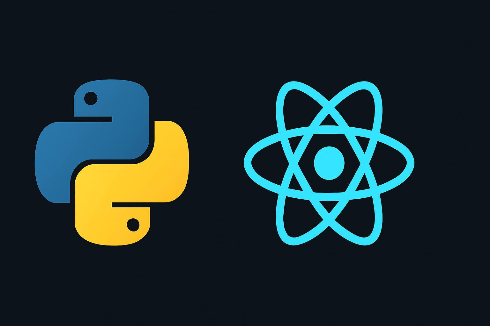

# Python-React full stack demo

A simple project utilizing Python for backend and React for frontend.
- [Backend](https://github.com/PranavKrishnaS/FullStack/tree/main/backend)
- [Frontend](https://github.com/PranavKrishnaS/FullStack/tree/main/frontend)

- [Installation](#installation)
- [Developer Profile](https://github.com/PranavKrishnaS)


# Installation
```shell
gh repo clone PranavKrishnaS/FullStack
```